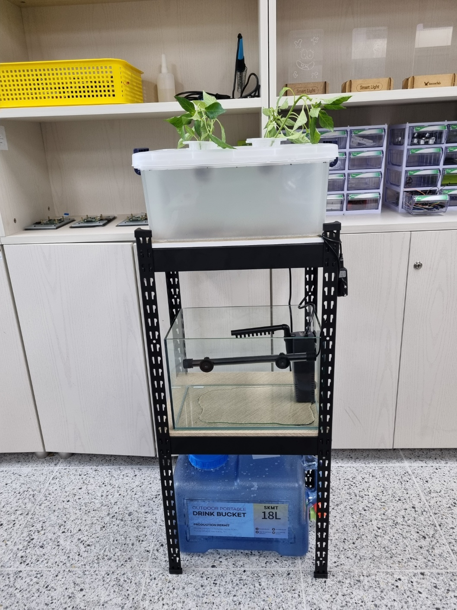
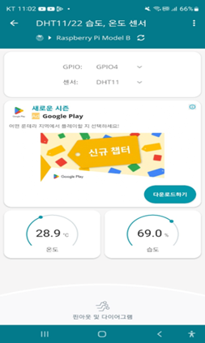
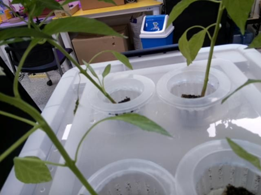
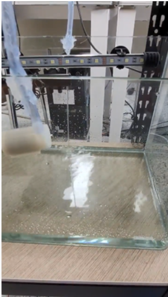

# YH_team

<h3>저희팀은 라즈베리파이를 활용하여 아쿠아 포닉스를 만들었습니다.</h3> 

<h4>(여기는 프로젝트에서 팀별 계획서 및 중간 발표, 최종 발표에 있었던 ppt가 기록이 되어있습니다.)</h4> 

<h2>밑에 보이시는 것은 외부형태 입니다.</h2>

<h4 style="text-align: center;">사용자 수행에 따른 세부 동작 과정</h4>
    
  

    <h4 style="text-align: center;">카메라 모듈은 앱에서 실행하게 되면 카메라 모듈의 화면을 휴대폰으로 보여줍니다. 
    온습도 센서는 gpio핀을 설정하고 새로 고침을 해서 앱에서 연동한 뒤 온도와 습도를 표시해줍니다. 
    모터 제어의 경우 on/off를 앱으로 해서 누르면 on의 경우 물이 나오고 off의 경우 물이 안나옵니다.</h4>  

